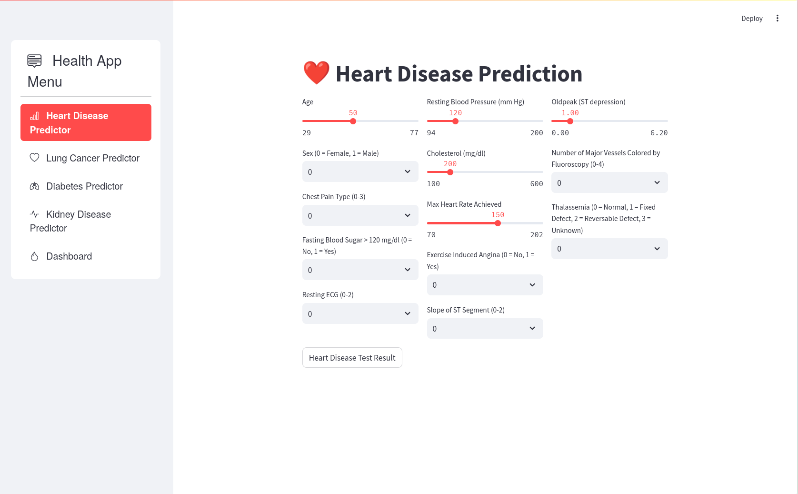
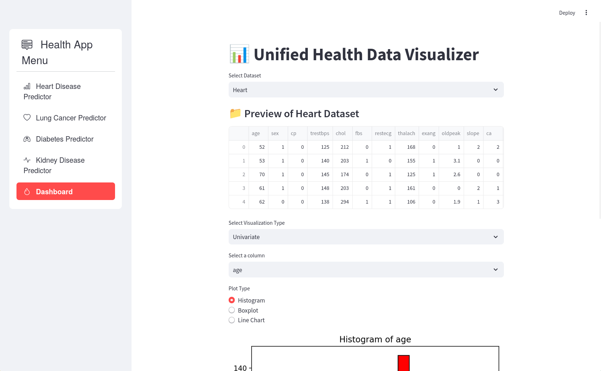
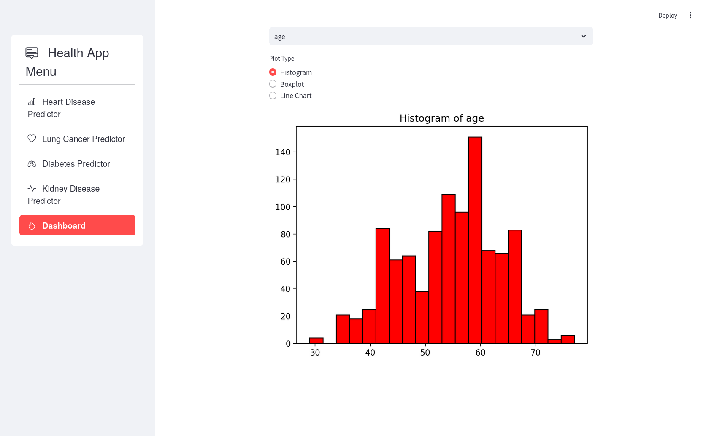

# FaceLink

FaceLink is a random video calling app built using Java and XML, designed to connect users through seamless video communication. Users can set up their profiles, engage in random video calls, and enjoy real-time interactions powered by WebRTC and PeerJS.

# Tecnhologies Used
- Android: Java and XML
- WebRTC: Web Real-Time Communication for video and audio streaming
- Firebase: Authentication, Realtime Database, Storage
- Glide: Image loading and caching library for smooth image rendering


## Table of Contents

- [Installation](#installation)
- [Usage](#usage)

# Installation

Provide step-by-step instructions on how to install and set up your project locally. For example:

- Clone the repository:
```bash
   https://github.com/yesheytenzin/heath_data_analytics.git
```
# Usage
- Install packages from the requirement.txt
- Command for running are in command.txt

# App Demo
<div style="display: flex; justify-content: space-between;">
  
  
  
</div>

